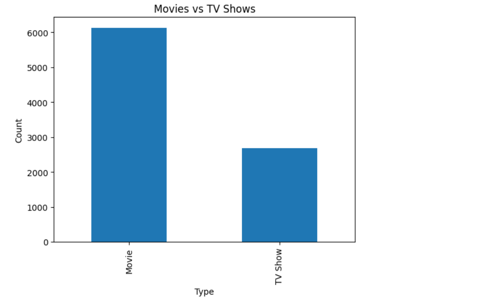
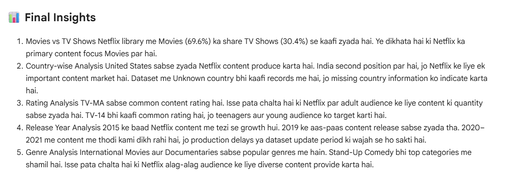
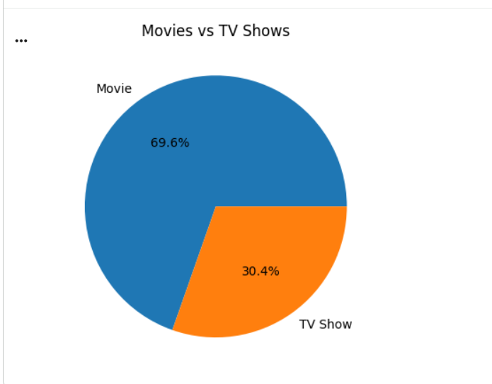
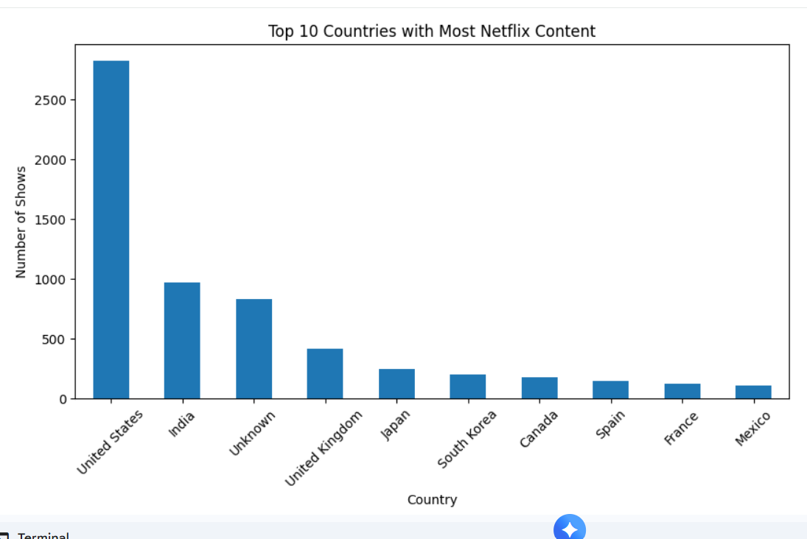
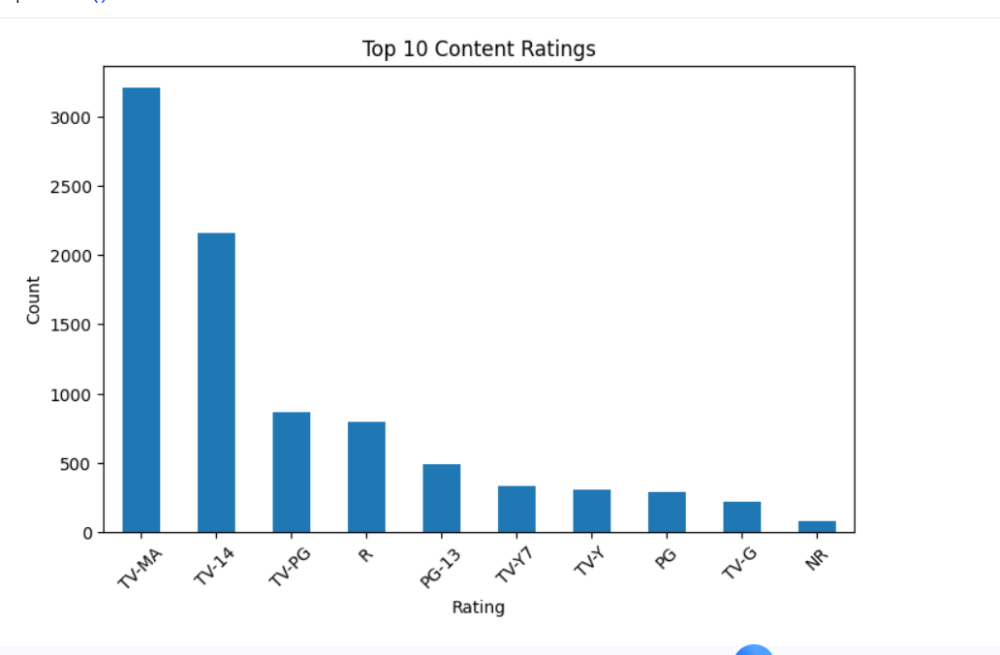
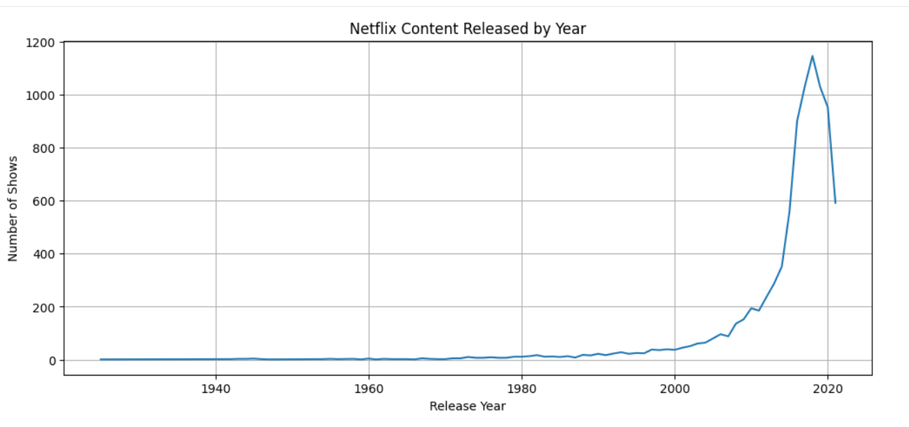

# Netflix Movies & TV Shows Data Analysis

## 📌 Project Overview
This project analyzes the Netflix Movies & TV Shows dataset using Python, Pandas, NumPy, and Matplotlib. The goal is to perform data cleaning, exploratory data analysis (EDA), and create visualizations to discover meaningful insights from the dataset.

## 📂 Dataset
- Dataset: Netflix Movies & TV Shows
- Total Columns: 12

## 🛠️ Tools & Libraries
- Python
- Pandas
- NumPy
- Matplotlib
- Google Colab

## 📋 Project Workflow
- Data Loading
- Data Understanding
- Data Cleaning
- Handling Missing Values
- Removing Duplicate Records
- Exploratory Data Analysis (EDA)
- Movies vs TV Shows Analysis
- Country-wise Analysis
- Rating Analysis
- Release Year Analysis
- Genre Analysis
- Data Visualization
- Final Insights

## 📊 Key Insights
- Netflix contains more Movies than TV Shows.
- The United States has the highest number of Netflix titles.
- TV-MA is the most common content rating.
- Netflix content increased rapidly after 2015.
- International Movies and Documentaries are among the most popular genres.

## 📁 Repository Files
- Netflix_Movies_TV_Shows_Analysis.ipynb
- netflix_titles.csv
- README.md

## 🎯 Conclusion
This project demonstrates practical skills in data cleaning, exploratory data analysis (EDA), and data visualization using Python. It highlights how data can be transformed into meaningful business insights.

---
⭐ If you found this project useful, feel free to star this repository.

## Project Visualizations

### Movies vs TV Shows

### Final Insights

### Movies vs TV Shows

### Country-wise Analysis

### Rating Analysis

### Netflix Content Released by Year

### Genres on Netflix

